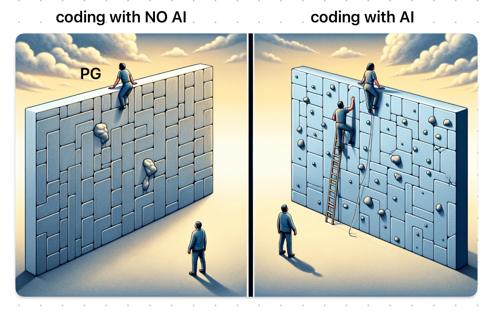

# Thoughts on AI Writing Programs

When internet translation first became possible, I was utterly amazed. Now, realizing that AI can write programs, I feel the same thrill as back then. Programmers might be wondering what I'm talking about, so I'd like to share my perspective.

First off...
Programmers are so smart that they might not understand how it feels not to be smart! Therefore, explanations about programming are usually too difficult...! What's GitHub? Where's the .exe file...?
That level of confusion!
Yet, AI (or rather, Cursor.sh) patiently helped me, practically doing everything for me, allowing me to create the tools I wanted, upload them to GitHub, and make them downloadable from anywhere. I managed to reach this point, albeit slowly.

Then, I thought, can I also create a website? And I tried writing something called GitHub Pages.
It was more troublesome than I expected, but it was nice to be able to write it where Cursor.sh could help.

Some might say it's wrong to let AI write programs without understanding the basics, but everyone uses translation software without knowing the basics of the languages they're translating. So, using AI to program without basics will probably become normal, too. Just as native English speakers' jobs aren't disappearing, native programmers' jobs won't disappear either. Just like an AI artist can't become Akira Toriyama, I can't become a real programmer. However, my world has expanded a bit, and I'm excited, so thank you!

This makes me think that AI really does have the potential to expand possibilities!