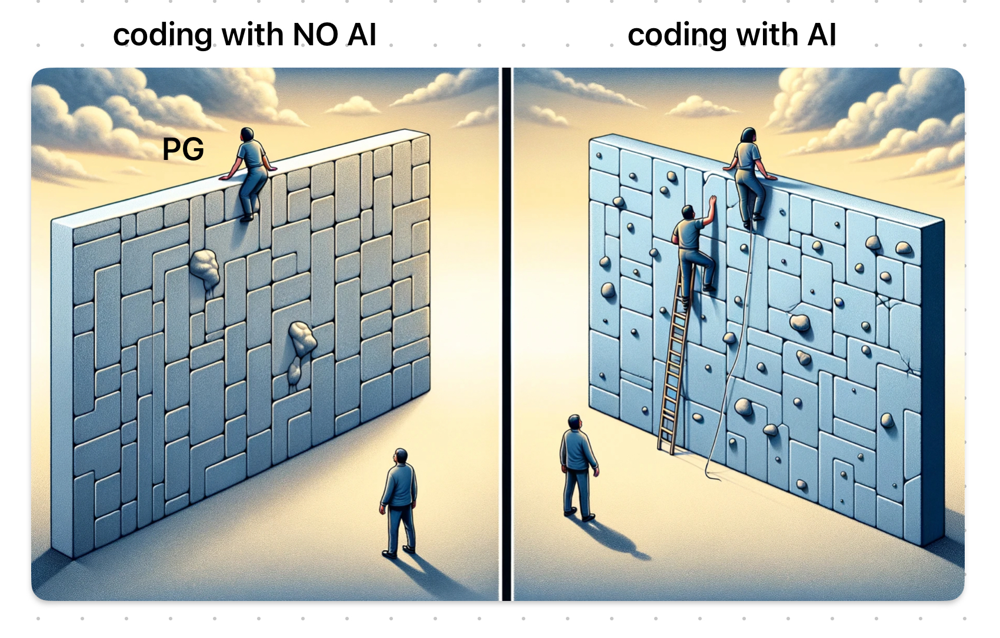

# AIがプログラム書いてくれるようになって思ったこと

はじめてネット翻訳ができたとき、めちゃくちゃびっくりしたんですけど
AIがプログラム書いてくれるのがわかって、あの時と同じびっくり感にときめいています
プログラマさんからしたらナニソレだと思うので、私から見た世界をおすそわけしてみます

まず…
プログラマさんはみなさん頭がいいから、頭がよくない人の気持ちがわからない！
だからプログラムに関する説明はだいたい難しすぎる…！
githubってなにぃ…exeはどこぉ…
このレベル！！
それでもAI（というか、Cursor.sh）は呆れずに、てとりあしとり…むしろほぼ全部私に代わってやってくれたので、
自分が使いたいツールを作って、githubにアップして、どこからでもＤＬできるところまで、
ヨボヨボとたどり着くことができました

そうなると、あれっ？じゃあホームページも作れちゃう？と思いついて
なんとなくgithub pagesというのを書いてみたのがこれ
思っていたよりは面倒だったけど、Cursor.shがいてくれる場所で書けるのがいい

基礎も出来てないくせにプログラムをAIに書かせるなよ！と言われるだろうけど
みんな基礎もないのに翻訳ソフトを使っているので
基礎もないのにAIプログラムも、きっと普通のことになるはず
一方で、英語ネイティブの仕事がなくならないように、
プログラムネイティブの仕事もなくならない。
ＡＩ絵師が鳥山明になれないように、自分も本物のプログラマにはなれない！
ただ、ちょっとだけ世界が広がって、わくわくしたから、ありがとう！

こんな感じで、ＡＩが可能性をひろげてくれる効果はあるかも！
ということを思ったよ。

